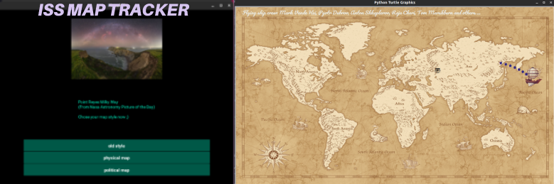

# ISS map tracker

<ul>
<h2>Functional:</h2>
<li>Astronomy Picture of the Day</li>
<li>ISS map tracker</li>
<li>(^_-)≡☆ 2.5 styles(old, new(2 map))</li>
</ul>


<ul>
<h2>For use:</h2>  
   <li>venv: python3.10 + all in requremets.txt</li>
   <li>tkinter in python</li>
   <li>install fonts on pc if u wanna see it)</li>
   <li>kivy if u want ui, or u can just run, Nasa_map.py with no ui)</li>
</ul>


``` virtualenv iss_map_tracker_env -p -python3.10  ``` ==> 
``` pip install -r requirements.txt ```
###### <p> Additional installation(maybe you already have it installed or not ;) : tkinter, kivy, fonts  </p>





