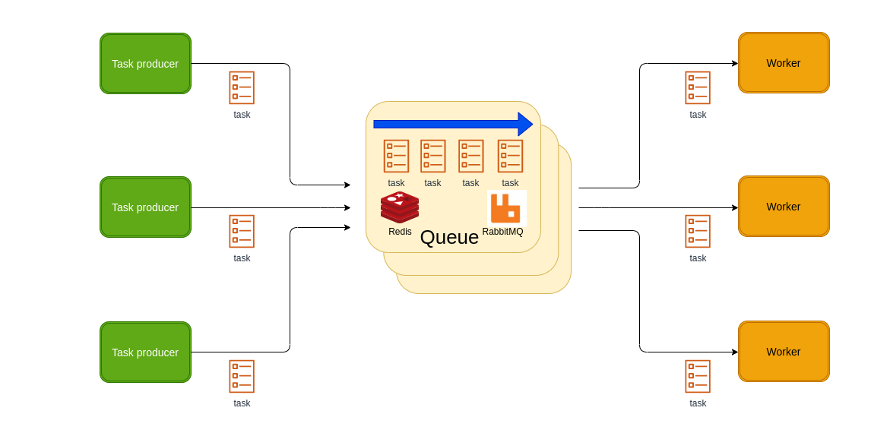
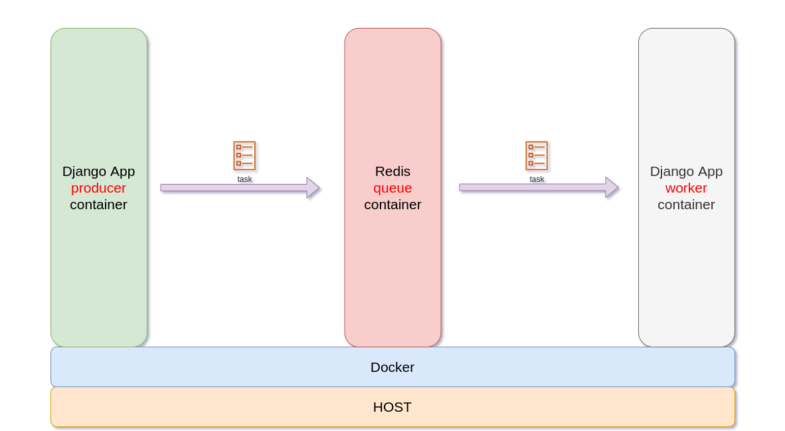

## Funny Cats Downloader

#### Django + Redis + Celery == example


##### step 0
If need install <a href="https://docs.docker.com/engine/install/ubuntu/">docker</a>

##### step 0 

```docker-compose up --build```




