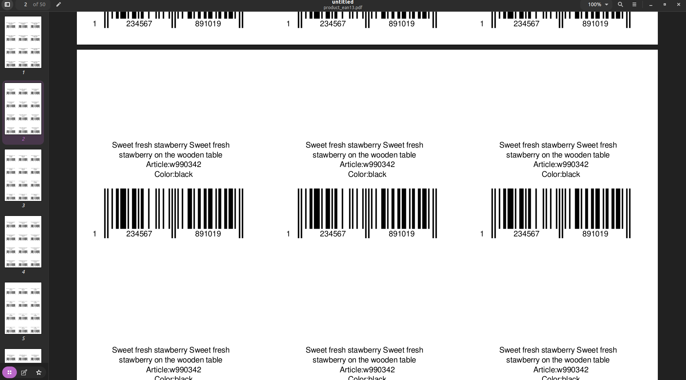
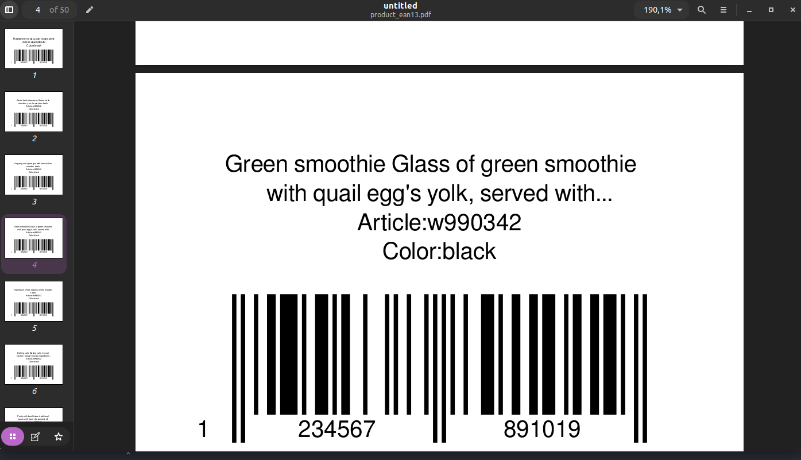

# Pdf generator
App for generate pdf files to products,

<h3> Have two presets: </h3>
<ul>
<li>A4: 1-3 card by line , 1-4 lines</li>
<li>Custom page + single card</li>
</ul>

Easy to customize,all settings at the beginning of the file

```
virtualenv pdf_env -p python3.10
pip install -r requirements.txt
source pdf_env/bin/activate
python3
```




